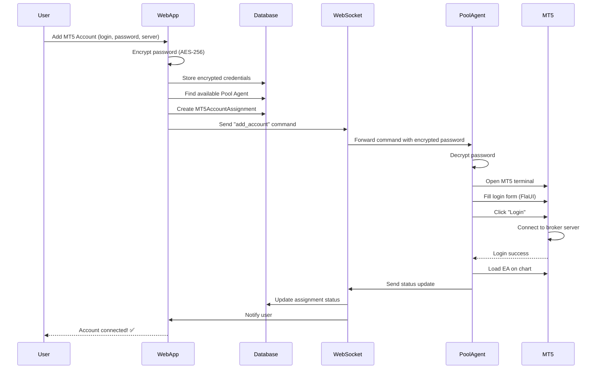

# MT5 Login Synchronization Flow
## Web App ↔ C# Pool Agent ↔ MT5 Terminals

This document explains how MT5 account credentials flow from the web app to the C# Pool Agent and ultimately log into MT5 terminals on the Windows server.

---

## 📊 Architecture Overview

```
┌─────────────────────────────────────────────────────────────────┐
│                   User Registration Flow                        │
└─────────────────────────────────────────────────────────────────┘

1. User registers at scalperium.com
2. User adds MT5 account (login, password, server, broker)
3. Credentials stored ENCRYPTED in database
4. Web app assigns user to available Pool Agent
5. Web app sends "add_account" command to Pool Agent via WebSocket
6. Pool Agent receives credentials and logs into MT5 terminal
7. MT5 terminal connects to broker
8. Pool Agent sends status back to web app
9. User can now control their EA through the web app
```

---

## 🗄️ Database Models

### 1. MT5Account (User's MT5 Credentials)

```prisma
model MT5Account {
  id            String  @id @default(uuid())
  userId        String
  user          User    @relation(fields: [userId], references: [id])

  // MT5 Login Credentials
  accountNumber String  @unique  // e.g., "50012345"
  broker        String           // "Exness" or "PrimeXBT"
  serverName    String           // "Exness-MT5Real"
  login         String           // MT5 login (usually same as accountNumber)
  password      String?          // ENCRYPTED with AES-256

  // Account Details
  accountType   String  @default("REAL")  // REAL or DEMO
  currency      String  @default("USD")
  leverage      Int     @default(500)
  balance       Float   @default(0)

  createdAt     DateTime @default(now())
  updatedAt     DateTime @updatedAt
}
```

### 2. MT5AccountAssignment (Pool Agent Assignment)

```prisma
model MT5AccountAssignment {
  id               String   @id @default(uuid())

  // User & Pool Agent
  userId           String
  user             User     @relation(fields: [userId], references: [id])
  agentId          String   // Pool agent managing this account
  agent            Agent    @relation(fields: [agentId], references: [id])

  // MT5 Account Info (duplicated for fast lookup)
  mt5AccountNumber String   @unique
  mt5Broker        String?
  mt5ServerName    String?

  // Status (updated by Pool Agent)
  status           String   @default("offline")  // offline, connecting, online, error
  eaStatus         String   @default("stopped")  // stopped, running, paused
  lastHeartbeat    DateTime?

  // Real-time Account Data (synced from MT5)
  balance          Float    @default(0)
  equity           Float    @default(0)
  profit           Float    @default(0)
  margin           Float    @default(0)
  freeMargin       Float    @default(0)

  // EA Info
  eaLoaded         Boolean  @default(false)
  eaRunning        Boolean  @default(false)
  eaName           String?

  assignedAt       DateTime @default(now())
}
```

---

## 🔐 Security: Credential Encryption

### Password Encryption (Web App)

```typescript
// src/lib/server/crypto.ts
import crypto from 'crypto';

const ENCRYPTION_KEY = process.env.MT5_ENCRYPTION_KEY!; // 32-byte key
const ALGORITHM = 'aes-256-gcm';

export function encryptPassword(password: string): string {
  const iv = crypto.randomBytes(16);
  const cipher = crypto.createCipheriv(ALGORITHM, Buffer.from(ENCRYPTION_KEY, 'hex'), iv);

  let encrypted = cipher.update(password, 'utf8', 'hex');
  encrypted += cipher.final('hex');

  const authTag = cipher.getAuthTag();

  // Return: iv:authTag:encrypted
  return `${iv.toString('hex')}:${authTag.toString('hex')}:${encrypted}`;
}

export function decryptPassword(encryptedData: string): string {
  const [ivHex, authTagHex, encrypted] = encryptedData.split(':');

  const decipher = crypto.createDecipheriv(
    ALGORITHM,
    Buffer.from(ENCRYPTION_KEY, 'hex'),
    Buffer.from(ivHex, 'hex')
  );

  decipher.setAuthTag(Buffer.from(authTagHex, 'hex'));

  let decrypted = decipher.update(encrypted, 'hex', 'utf8');
  decrypted += decipher.final('utf8');

  return decrypted;
}
```

---

## 🌊 Complete Synchronization Flow

### Step 1: User Adds MT5 Account (Web App)

**Frontend: `/routes/dashboard/+page.svelte`**
```svelte
<script>
  let mt5Form = {
    accountNumber: '',
    broker: 'Exness',
    serverName: 'Exness-MT5Real',
    login: '',
    password: ''
  };

  async function addMT5Account() {
    const response = await fetch('/api/user/accounts', {
      method: 'POST',
      headers: { 'Content-Type': 'application/json' },
      body: JSON.stringify(mt5Form)
    });

    if (response.ok) {
      alert('MT5 Account added! Connecting to Pool Agent...');
    }
  }
</script>

<input bind:value={mt5Form.accountNumber} placeholder="MT5 Account Number" />
<input bind:value={mt5Form.login} placeholder="Login" />
<input bind:value={mt5Form.password} type="password" placeholder="Password" />
<select bind:value={mt5Form.broker}>
  <option>Exness</option>
  <option>PrimeXBT</option>
</select>
<input bind:value={mt5Form.serverName} placeholder="Server (e.g., Exness-MT5Real)" />
<button on:click={addMT5Account}>Add MT5 Account</button>
```

**Backend API: `/routes/api/user/accounts/+server.ts`**
```typescript
import { json } from '@sveltejs/kit';
import { PrismaClient } from '@prisma/client';
import { encryptPassword } from '$lib/server/crypto';
import { getSessionUser } from '$lib/server/auth';
import { sendCommandToPoolAgent } from '$lib/server/agent-client';

const prisma = new PrismaClient();

export const POST: RequestHandler = async ({ request, cookies }) => {
  const sessionUser = getSessionUser(cookies);
  if (!sessionUser) {
    return json({ error: 'Unauthorized' }, { status: 401 });
  }

  const { accountNumber, broker, serverName, login, password } = await request.json();

  // 1. Encrypt password
  const encryptedPassword = encryptPassword(password);

  // 2. Store in database
  const mt5Account = await prisma.mT5Account.create({
    data: {
      userId: sessionUser.userId,
      accountNumber,
      broker,
      serverName,
      login,
      password: encryptedPassword
    }
  });

  // 3. Find available Pool Agent (lowest load)
  const poolAgent = await prisma.agent.findFirst({
    where: {
      isPoolAgent: true,
      status: 'online',
      currentLoad: { lt: prisma.agent.fields.maxCapacity }
    },
    orderBy: { currentLoad: 'asc' }
  });

  if (!poolAgent) {
    return json({ error: 'No pool agents available' }, { status: 503 });
  }

  // 4. Create assignment
  const assignment = await prisma.mT5AccountAssignment.create({
    data: {
      userId: sessionUser.userId,
      agentId: poolAgent.id,
      mt5AccountNumber: accountNumber,
      mt5Broker: broker,
      mt5ServerName: serverName,
      status: 'connecting'
    }
  });

  // 5. Send "add_account" command to Pool Agent via WebSocket
  await sendCommandToPoolAgent(poolAgent.id, {
    type: 'add_account',
    commandId: crypto.randomUUID(),
    payload: {
      userId: sessionUser.userId,
      assignmentId: assignment.id,
      accountNumber,
      broker,
      serverName,
      login,
      password: encryptedPassword  // Send encrypted password
    }
  });

  return json({ success: true, mt5Account, assignment });
};
```

---

### Step 2: WebSocket Message to Pool Agent

**Message Format (Web App → C# Pool Agent)**:
```json
{
  "type": "add_account",
  "commandId": "cmd-uuid-123",
  "payload": {
    "userId": "user-uuid-456",
    "assignmentId": "assignment-uuid-789",
    "accountNumber": "50012345",
    "broker": "Exness",
    "serverName": "Exness-MT5Real",
    "login": "50012345",
    "password": "iv:authTag:encryptedPasswordData"
  },
  "timestamp": 1705012345678
}
```

---

### Step 3: C# Pool Agent Receives Command

**C# Code: `Program.cs`**
```csharp
protected override async Task OnMessageReceived(string message)
{
    var json = JsonSerializer.Deserialize<JsonElement>(message);
    var type = json.GetProperty("type").GetString();

    if (type == "add_account")
    {
        var commandId = json.GetProperty("commandId").GetString();
        var payload = json.GetProperty("payload");

        var userId = payload.GetProperty("userId").GetString();
        var assignmentId = payload.GetProperty("assignmentId").GetString();
        var accountNumber = payload.GetProperty("accountNumber").GetString();
        var broker = payload.GetProperty("broker").GetString();
        var serverName = payload.GetProperty("serverName").GetString();
        var login = payload.GetProperty("login").GetString();
        var encryptedPassword = payload.GetProperty("password").GetString();

        // Decrypt password using same algorithm as web app
        var password = CryptoHelper.DecryptPassword(encryptedPassword);

        // Add account to MultiMT5Controller
        var result = await _mt5Controller.AddMT5Account(new MT5AccountInfo
        {
            AccountNumber = accountNumber,
            Broker = broker,
            ServerName = serverName,
            Login = login,
            Password = password,
            UserId = userId,
            AssignmentId = assignmentId
        });

        // Send result back to server
        await SendMessage(JsonSerializer.Serialize(new
        {
            type = "command_result",
            commandId = commandId,
            success = result.Success,
            result = result,
            timestamp = DateTimeOffset.UtcNow.ToUnixTimeMilliseconds()
        }));
    }
}
```

**C# Crypto Helper: `CryptoHelper.cs`**
```csharp
using System.Security.Cryptography;
using System.Text;

public static class CryptoHelper
{
    private static readonly string EncryptionKey = Environment.GetEnvironmentVariable("MT5_ENCRYPTION_KEY");

    public static string DecryptPassword(string encryptedData)
    {
        var parts = encryptedData.Split(':');
        var iv = Convert.FromHexString(parts[0]);
        var authTag = Convert.FromHexString(parts[1]);
        var encrypted = Convert.FromHexString(parts[2]);

        using var aes = new AesGcm(Convert.FromHexString(EncryptionKey));
        var decrypted = new byte[encrypted.Length];

        aes.Decrypt(iv, encrypted, authTag, decrypted);

        return Encoding.UTF8.GetString(decrypted);
    }
}
```

---

### Step 4: Pool Agent Logs into MT5 Terminal

**C# Code: `MultiMT5Controller.cs`**
```csharp
public async Task<MT5LoginResult> AddMT5Account(MT5AccountInfo accountInfo)
{
    try
    {
        Console.WriteLine($"[ADD_ACCOUNT] Adding MT5 account: {accountInfo.AccountNumber}");

        // 1. Find available MT5 terminal (not in use)
        var availableTerminal = GetAvailableMT5Terminal();
        if (availableTerminal == null)
        {
            return new MT5LoginResult { Success = false, Error = "No available MT5 terminals" };
        }

        // 2. Attach to MT5 window using FlaUI
        var mt5Window = FindMT5Window(availableTerminal.ProcessId);
        if (mt5Window == null)
        {
            return new MT5LoginResult { Success = false, Error = "Could not find MT5 window" };
        }

        // 3. Open login dialog
        var automation = new UIA3Automation();
        var window = mt5Window.AsWindow();

        // Click "File" → "Login to Trade Account"
        var fileMenu = window.FindFirstDescendant(cf => cf.ByName("File").And(cf.ByControlType(ControlType.MenuItem)));
        fileMenu?.Click();

        await Task.Delay(500);

        var loginMenuItem = window.FindFirstDescendant(cf => cf.ByName("Login to Trade Account"));
        loginMenuItem?.Click();

        await Task.Delay(1000);

        // 4. Find login dialog
        var loginDialog = window.FindFirstChild(cf => cf.ByName("Login").And(cf.ByControlType(ControlType.Window)));
        if (loginDialog == null)
        {
            return new MT5LoginResult { Success = false, Error = "Login dialog not found" };
        }

        // 5. Fill in credentials
        var loginField = loginDialog.FindFirstDescendant(cf => cf.ByAutomationId("LoginEdit"));
        loginField?.AsTextBox().Text = accountInfo.Login;

        var passwordField = loginDialog.FindFirstDescendant(cf => cf.ByAutomationId("PasswordEdit"));
        passwordField?.AsTextBox().Text = accountInfo.Password;

        var serverField = loginDialog.FindFirstDescendant(cf => cf.ByAutomationId("ServerComboBox"));
        serverField?.AsComboBox().Select(accountInfo.ServerName);

        // 6. Click "Login" button
        var loginButton = loginDialog.FindFirstDescendant(cf => cf.ByName("Login").And(cf.ByControlType(ControlType.Button)));
        loginButton?.Click();

        // 7. Wait for connection
        await Task.Delay(5000);

        // 8. Verify login success
        var accountNumberInTitle = GetAccountNumberFromTitle(mt5Window);
        if (accountNumberInTitle == accountInfo.AccountNumber)
        {
            Console.WriteLine($"[SUCCESS] MT5 account {accountInfo.AccountNumber} logged in successfully");

            // 9. Register in instances dictionary
            _instances[accountInfo.AccountNumber] = new MT5Instance
            {
                AccountNumber = accountInfo.AccountNumber,
                Process = availableTerminal.Process,
                MainWindow = mt5Window,
                Broker = accountInfo.Broker,
                ServerName = accountInfo.ServerName,
                UserId = accountInfo.UserId,
                AssignmentId = accountInfo.AssignmentId,
                Status = "online",
                LastActivity = DateTime.UtcNow
            };

            // 10. Load EA automatically
            await LoadEAOnChart(accountInfo.AccountNumber, "Gold Scalper Pro v2.1", "XAUUSD", "M5");

            return new MT5LoginResult
            {
                Success = true,
                AccountNumber = accountInfo.AccountNumber,
                Message = "Logged in successfully"
            };
        }
        else
        {
            return new MT5LoginResult
            {
                Success = false,
                Error = "Login failed - invalid credentials or server down"
            };
        }
    }
    catch (Exception ex)
    {
        Console.WriteLine($"[ERROR] Failed to add MT5 account: {ex.Message}");
        return new MT5LoginResult { Success = false, Error = ex.Message };
    }
}
```

---

### Step 5: Pool Agent Sends Status Update

**C# Code: Heartbeat Status Update**
```csharp
private async Task SendBatchedStatusUpdate()
{
    var accountStatuses = _instances.Values.Select(instance => new
    {
        accountNumber = instance.AccountNumber,
        status = instance.Status,
        eaStatus = instance.EARunning ? "running" : "stopped",
        balance = GetAccountBalance(instance),
        equity = GetAccountEquity(instance),
        profit = GetAccountProfit(instance),
        eaLoaded = instance.EALoaded,
        eaRunning = instance.EARunning,
        eaName = instance.EAName,
        lastActivity = instance.LastActivity.ToUnixTimeMilliseconds()
    }).ToList();

    var statusUpdate = new
    {
        type = "multi_status_update",
        agentId = _agentId,
        vpsName = _vpsName,
        systemInfo = new
        {
            cpuUsage = GetCPUUsage(),
            memoryUsage = GetMemoryUsage(),
            mt5InstanceCount = _instances.Count
        },
        accounts = accountStatuses,
        timestamp = DateTimeOffset.UtcNow.ToUnixTimeMilliseconds()
    };

    await SendMessage(JsonSerializer.Serialize(statusUpdate));
}
```

---

### Step 6: Web App Updates Database

**Backend: WebSocket Handler (`websocket-server.ts`)**
```typescript
// Handle status updates from Pool Agent
if (message.type === 'multi_status_update') {
  const { agentId, accounts } = message;

  // Update all account assignments in database
  for (const account of accounts) {
    await prisma.mT5AccountAssignment.update({
      where: { mt5AccountNumber: account.accountNumber },
      data: {
        status: account.status,
        eaStatus: account.eaStatus,
        balance: account.balance,
        equity: account.equity,
        profit: account.profit,
        eaLoaded: account.eaLoaded,
        eaRunning: account.eaRunning,
        eaName: account.eaName,
        lastHeartbeat: new Date()
      }
    });
  }

  // Update agent stats
  await prisma.agent.update({
    where: { id: agentId },
    data: {
      currentLoad: accounts.length,
      cpuUsage: message.systemInfo.cpuUsage,
      memoryUsage: message.systemInfo.memoryUsage,
      mt5InstanceCount: message.systemInfo.mt5InstanceCount,
      lastHeartbeat: new Date()
    }
  });
}
```

---

## 🔄 Complete Flow Diagram



---

## 🛡️ Security Best Practices

1. **Encryption at Rest**: Passwords stored with AES-256-GCM
2. **Encryption in Transit**: WebSocket uses WSS (TLS)
3. **Key Management**: Encryption key stored in environment variable
4. **No Plain Text**: Password never sent or stored in plain text
5. **Access Control**: Only Pool Agent with matching API key can decrypt
6. **Audit Logging**: All login attempts logged with timestamp

---

## 📝 API Endpoint Summary

| Endpoint | Method | Purpose |
|----------|--------|---------|
| `/api/user/accounts` | POST | Add new MT5 account |
| `/api/user/accounts` | GET | List user's MT5 accounts |
| `/api/user/accounts/:id` | DELETE | Remove MT5 account |
| `/api/admin/pool-agents` | GET | View all Pool Agents |
| `/api/admin/assignments` | GET | View all account assignments |

---

## 🧪 Testing the Flow

### 1. Add MT5 Account (Web App)
```bash
curl -X POST http://localhost:5173/api/user/accounts \
  -H "Content-Type: application/json" \
  -H "Cookie: session=..." \
  -d '{
    "accountNumber": "50012345",
    "broker": "Exness",
    "serverName": "Exness-MT5Real",
    "login": "50012345",
    "password": "MySecurePassword123"
  }'
```

### 2. Check Pool Agent Logs (C#)
```
[ADD_ACCOUNT] Adding MT5 account: 50012345
[MT5] Opening login dialog...
[MT5] Filling credentials...
[MT5] Logging in...
[SUCCESS] MT5 account 50012345 logged in successfully
[EA] Loading Gold Scalper Pro v2.1 on XAUUSD M5...
[EA] EA loaded and running
```

### 3. Verify in Database
```sql
SELECT * FROM "MT5AccountAssignment" WHERE "mt5AccountNumber" = '50012345';
-- Should show: status='online', eaStatus='running'
```

---

## 🚀 Next Steps

1. ✅ Database schema defined
2. ✅ Encryption/decryption implemented
3. ⏳ Create `/api/user/accounts` endpoint
4. ⏳ Implement WebSocket command routing
5. ⏳ Complete C# Pool Agent MT5 login automation
6. ⏳ Test end-to-end flow with 1 account
7. ⏳ Scale to 50 accounts on production VPS

---

**Last Updated**: January 12, 2026
